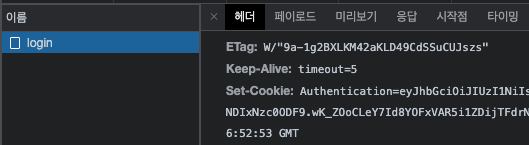

# 로그인 / 회원가입

로그인과 회원가입을 구현하기 위해서는 다음과 같은 기능들을 필요로 한다.

* DB
  * User CRUD
* **인증 (Authentication)**
* 권한 설정

## 인증 개요

이번 문서에서는 아래의 세 기능을 구현한다.

1. 사용자 인증 (계정/암호, JWT 등을 이용)
2. 사용자 인증 상태 관리 (JWT 등)
3. 엔드포인트 보호

우선은 세 기능의 관리를 용이하게 해주는 `passport` 라이브러리와  
사용자 인증과 인증상태 관리를 위한 JWT 라이브러리를 함께 설치해준다.

```shell
$ npm i @nestjs/passport passport

$ npm i @nestjs/jwt passport-jwt
$ npm i -D @types/passport-jwt
```

## Auth Module 작성

인증과 관련된 로직을 작성하기 위해, `AuthModule`, `AuthService`, `AuthController` 등 Auth와 관련된 아이템을 생성한다.

```shell
$ nx g @nrwl/nest:module app/auth -p modern-tmi-server
$ nx g @nrwl/nest:service app/auth -p modern-tmi-server
$ nx g @nrwl/nest:controller app/auth -p modern-tmi-server
```

사용자 인증을 위해 `login` 로직을 작성한다.

```typescript
// app/auth/auth.service.ts

@Injectable()
export class AuthService {
    constructor(private usersService: UsersService) {}
    
    async validateUser(email: string, plainPassword: string) {
        // 이메일을 통해 DB의 User 정보를 가져온다
        const user = await this.usersService.findOnebyEmail(email);
        
        // 입력받은 password와 DB의 password를 비교한다
        // 실제로는 hash 처리 되어 있으므로 hash를 비교하는 로직이 필요
        if (user && (plainPassword === user.password)) {
            const {password, ...result} = user;
            return result;
        }
        
        return null;
    }
    
    async login(loginUser: any) {
        const user = await this.validateUser(loginUser.email, loginUser.password);
        if (!user) {
            throw new HttpException(
                '로그인 실패!',
                HttpStatus.BAD_REQUEST
            );
        }
        
        return user;
    }
}
```

```typescript
// app/auth/auth.controller.ts

@Controller('auth')
export class AuthController {
    constructor(private authService: AuthService) {}
    
    @Post('login')
    async login(@Body() loginUser: any) {
        return this.authService.login(loginUser);
    }
}
```

```typescript
// app/auth/auth.module.ts

@Module({
    imports: [UsersModule],
    controllers: [AuthController],
    providers: [AuthService],
    exports: [AuthService]
})
export class AuthModule {}
```

위의 로직을 바탕으로 사용자는 `http://localhost/auth/login` URL에 POST로 접근해 Login을 할 수 있다.

## JWT 연결

기존의 로직은 로그인 성공시 로그인 유저의 정보를 반환한다.  
이제는 로그인 성공시 로그인 유저의 정보를 갖는 JWT를 반환하는 로직을 작성한다.

```typescript
// app/auth/auth.service.ts

@Injectable()
export class AuthService {
    constructor(
        private usersService: UsersService,
        private jwtService: JwtService      // JWT 처리를 위한 서비스
    ) {}

    // validateUser 로직은 변경 없음
    
    async login(loginUser: any) {
        const user = await this.validateUser(loginUser.email, loginUser.password);
        if (!user) {
            throw new HttpException(
                '로그인 실패!',
                HttpStatus.BAD_REQUEST
            );
        }
        
        // 유저정보를 바탕으로 access token 생성
        const payload = {
            id: user.id,
        }
        const accessToken = this.jwtService.sign(payload)

        return {
            accessToken
        }
    }
}
```

이후 JWT 의 서명을 위한 `secret`과 Token의 만료 시간을 `JWTModule`에 등록해준다.

```typescript
// app/auth/auth.module.ts

@Module({
    imports: [
        UsersModule,
        JwtModule.register({
            secret: "MY_SECRET_KEY",
            signOptions: {
                expiresIn: '60s' // 토큰의 만료시간 설정
            }
        })
    ],
    controllers: [AuthController],
    providers: [AuthService],
    exports: [AuthService]
})
export class AuthModule {}
```

로그인을 통해 JWT를 발급받는 시점에서 인증의 세가지 중 

1. 사용자 인증 (JWT 발급)
2. 사용자 인증 상태 관리(JWT 만료시간까지 인증상태 유지)

두 가지의 기능이 작성 되었다.

## Cookie 를 이용한 JWT 처리

Token을 Cookie에 저장하면 Request를 보낼때 자동으로 담아서 보내지기 때문에 관리가 용이하다.

서버에서 쿠키를 사용하기 위해 `cookie-parser` 미들웨어를 설치한다.

```shell
$ npm i cookie-parser
$ npm i -D @types/cookie-parser
```

설치된 `cookie-parser` 미들웨어는 `main.ts`에 등록해준다

```typescript
// main.ts

import * as cookieParser from 'cookie-parser';

...
app.use(cookieParser());
...

```

로그인 이후 Response로 넘겨준 토큰을 Cookie에 담아 보낼 수 있도록 로직을 수정해준다.

```typescript
// app/auth/auth.controller.ts

@Controller('auth')
export class AuthController {
    constructor(private authService: AuthService) {}

    @Post('login')
    async login(@Body() loginUser: any, @Res({passthrough: true}) res: Response) {
        const { accessToken } = await this.authService.login(loginUser);
        
        res.cookie('Autentication', accessToken, {
            domain: 'localhost',
            path: '/',
            httpOnly: true,
            secure: true,
            maxAge: 60      // 60 seconds
        });
        
        return true;
    }
}
```

로그인이 성공적으로 되면 `Authentication` 이라는 이름의 쿠키가 생성된다.


## Passport JWT Strategy 작성

`Passport`는 `Strategy`를 사용해 인증단계를 추상화 한다.  
우리는 JWT를 사용하므로 JWT를 사용하는 Strategy를 작성한다.

```typescript
// app/auth/strategy/jwt.strategy.ts

@Injectable()
export class JwtStrategy extends PassportStrategy(Strategy, 'jwt') {
    constructor(private readonly usersService: UsersService) {
        super({
            jwtFromRequest: ExtractJwt.fromExtractors([
                (request) => request?.cookies?.Authentication  
            ]),
            secretOrKey: "MY_SECRET_KEY"
        })
    }
    
    async validate(payload: any) {
        return this.usersService.findOne(payload.id);
    }
}
```

`JwtStrategy`에 작성된 각각의 옵션과 함수는 다음과 같은 역할을 한다.

* `jwtFromRequest`: `Request` 에서 JWT를 추출한다. 현재 `Authentication`이라는 이름의 쿠키에 JWT가 담겨 있으므로 `request?.cookies?.Authentication`을 통해 JWT를 가져온다
* `secretOrKey`: 토큰 서명을 위해 사용하는 Secret key
* `validate()`: `jwt-strategy`를 사용하는 passport가 내부적으로 JWT 서명을 확인 한 후 JWT를 디코딩 한다. 그 후 디코딩 된 payload를 매개변수로 validate() 메소드를 호출.   

이렇게 작성된 `JwtStrategy`는 `AuthModule`의 `Provider`에 등록해준다.

```typescript
// app/auth/auth.module.ts

@Module({
    imports: [
        UsersModule,
        JwtModule.register({
            secret: "MY_SECRET_KEY",
            signOptions: {
                expiresIn: '60s' // 토큰의 만료시간 설정
            }
        })
    ],
    controllers: [AuthController],
    providers: [AuthService, JwtStrategy], // JwtStrategy 추가!
    exports: [AuthService]
})
export class AuthModule {}
```


## Route Guard 작성

이제 유효한 인증에 대해서만 Route를 사용할 수 있도록 Route Guard를 작성할 수 있다.  
위에서 작성한 `JwtStrategy`를 이용해 Route Guard를 작성한다.

```typescript
// app/auth/guards/jwt-auth.guard.ts

@Injectable()
export class JwtAuthGuard extends AuthGuard('jwt') {}
```

`AuthGuard()` 안의 파라미터로는 `Strategy` 작성에 사용한 name(`jwt`)을 기입해준다.

작성된 `JwtAuthGuard`는 이제 인증이 필요한 Route에 연결 시켜줄 수 있다.

```typescript
// sample

@Controller('sample')
export class SampleController {
    constructor(private sampleService: SampleService) {}

    @UseGuards(JwtAuthGuard)    // <- JwtAuthGuard 사용!
    @Get()
    someData() {
        return this.sampleService.sample()
    }
}
```

위의 `someData()`는 로그인을 해 `Authentication` 쿠키가 설정된 이후에만 접근 할 수 있다.
