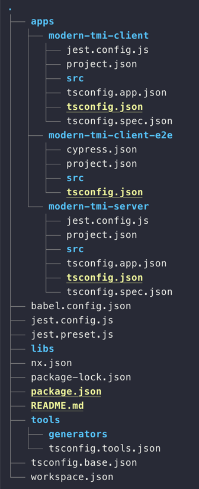

# 프로젝트 세팅

React와 Nest를 기반으로 모노레포 시스템을 구축해본다.

모노레포 환경 구축으로는 Nx를 사용한다.

### Client

nx workspace를 생성하고, 기술스택에 맞게 프로젝트를 세팅해준다.

```
$ npx create-nx-workspace@latest

✔ Workspace name (e.g., org name)     · modern-tmi
✔ What to create in the new workspace · react
✔ Application name                    · modern-tmi-client
✔ Default stylesheet format           · @emotion/styled
✔ Use Nx Cloud? (It's free and doesn't require registration.) · No
```


### Server

Server Application을 Nest 기반으로 생성한다.

```shell
cd modern-tmi/

# nest generater 설치
npm i -D @nrwl/nest@latest

# nest server 추가
nx g @nrwl/nest:app modern-tmi-server
```

---

Client와 Server 설치가 끝나면 아래와 같은 디렉토리 구조가 나온다



이후 `workspace.json`에 `defaultProject`를 추가해준다.

```json
{
  "version": 2,
  "projects": {
    "modern-tmi-client": "apps/modern-tmi-client",
    "modern-tmi-client-e2e": "apps/modern-tmi-client-e2e",
    "modern-tmi-server": "apps/modern-tmi-server"
  },
  "defaultProject": "modern-tmi-client"
}
```

이후 각 프로젝트의 dev server는 아래와 같은 명령어로 실행 시킬 수 있다.
```shell
$ nx serve
# nx serve modern-tmi-client

$ nx serve modern-tmi-server
```
